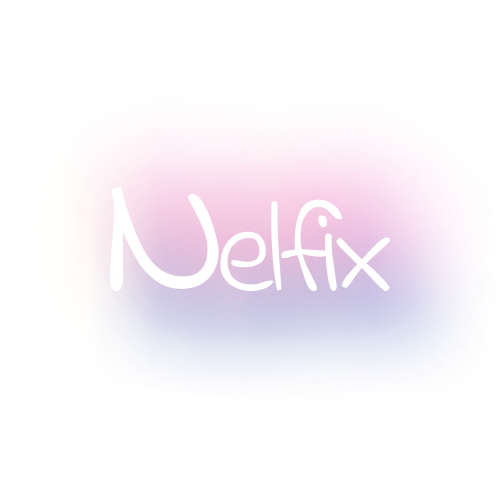
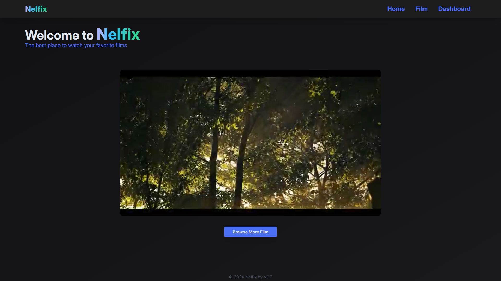
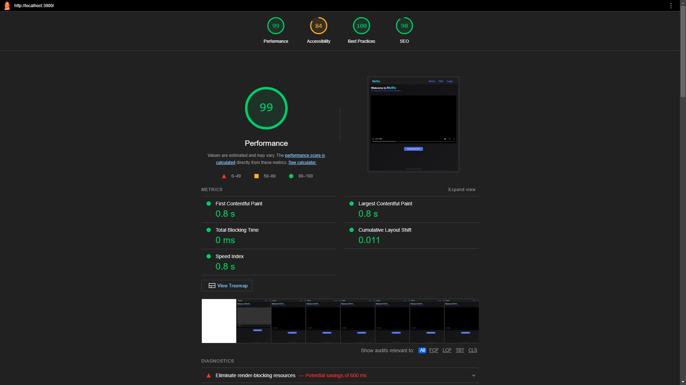
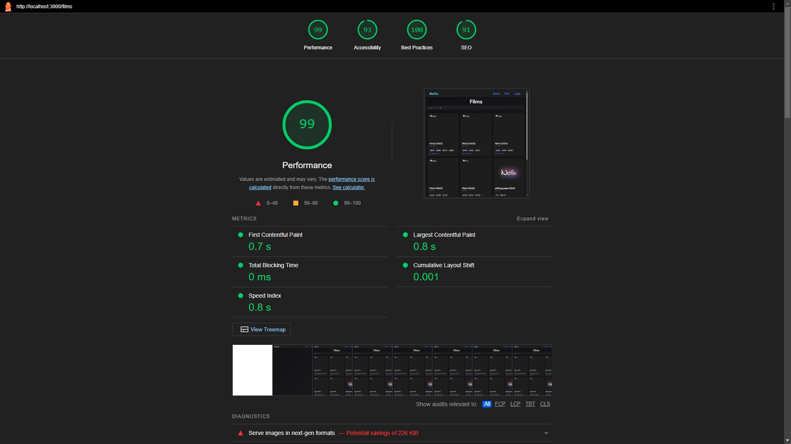
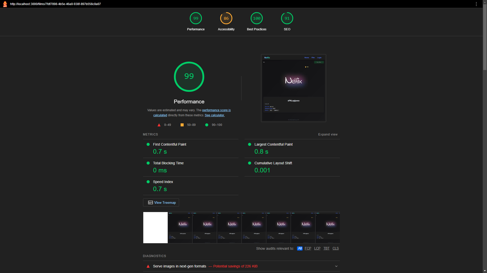
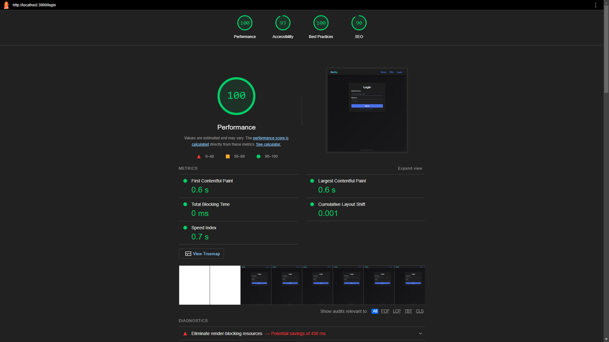
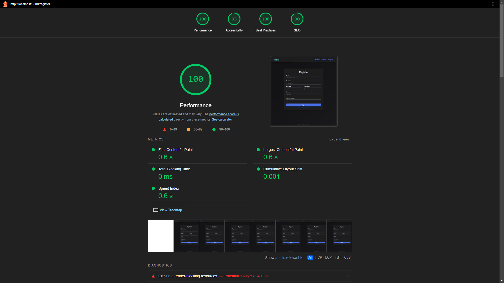

<!-- Improved compatibility of back to top link: See: https://github.com/othneildrew/Best-README-Template/pull/73 -->

<a name="readme-top"></a>

<!--
*** Thanks for checking out the Best-README-Template. If you have a suggestion
*** that would make this better, please fork the repo and create a pull request
*** or simply open an issue with the tag "enhancement".
*** Don't forget to give the project a star!
*** Thanks again! Now go create something AMAZING! :D
-->

<!-- PROJECT SHIELDS -->
<!--
*** I'm using markdown "reference style" links for readability.
*** Reference links are enclosed in brackets [ ] instead of parentheses ( ).
*** See the bottom of this document for the declaration of the reference variables
*** for contributors-url, forks-url, etc. This is an optional, concise syntax you may use.
*** https://www.markdownguide.org/basic-syntax/#reference-style-links
-->

<!-- PROJECT LOGO -->
<br />
<div align="center">
  <a href="https://github.com/ValentinoTriadi/Labpro-Seleksi-3-NestJS">
    
  </a>
  <h1>Nelfix</h1>
  <p align="center">
    A Film Provider Web-based Application 
    <br />
    <a href="https://github.com/ValentinoTriadi/Labpro-Seleksi-3-NestJS"><strong>Explore the docs »</strong></a>
    ·
    <a href="https://github.com/ValentinoTriadi/Labpro-Seleksi-3-NestJS/issues">Report Bug</a>
    <br/>
  </p>
</div>

<!-- TABLE OF CONTENTS -->
<details>
  <summary>Table of Contents</summary>
  <ol>
    <li>
      <a href="#about-the-project">About The Project</a>
      <ul>
        <li><a href="#built-with">Built With</a></li>
        <li><a href="#features">Features</a></li>
        <li><a href="#Design-Pattern">Design Pattern</a></li>
        <li><a href="#API-Endpoints">API Endpoints</a></li>
        <li><a href="#bonus">Bonus</a></li>
      </ul>
    </li>
    <li><a href="#requirement">Requirement</a></li>
    <li><a href="#usage">Usage</a></li>
    <li><a href="#Project-Status">Project Status</a></li>
    <li><a href="#Room-for-Improvement">Room for Improvement</a></li>
    <li><a href="#Acknowledgments">Acknowledgments</a></li>
  </ol>
</details>

<!-- ABOUT THE PROJECT -->

## About The Project



Nelfix is a web-based application that provides a variety of films for users to watch. Users can watch films by purchasing any film that available. Users can also see the details of the film they want to watch. Nelfix also provides a search feature to make it easier for users to find the film they want to watch.

<br/>

<p align="right">(<a href="#readme-top">back to top</a>)</p>

### Built With

[![Nest][Nest]][Nest-url]
[![Tailwind][Tailwind]][Tailwind-url]
[![Prisma][Prisma]][Prisma-url]
[![PostgreSQL][PostgreSQL]][PostgreSQL-url]

<br/>

### Features

- Watch Film
- Buy Film
- Search Film
- View Film Details
- Admin API
- Authentication
- Authorization

### Design Pattern

| Design Pattern | Description                                                                                  |
| -------------- | -------------------------------------------------------------------------------------------- |
| Singleton      | Used for utils class that only need 1 instance (e.g src\utils\bcrypt.ts & src\utils\time.ts) |
| Strategy       | Used for file storage bucket implementation to make calls easier.                            |
| Factory        | Used for creating a new instance of PrismaClient for a specific use.                         |

### API Endpoints

`Notes: ALL ENDPOINT FOR ADMIN ARE USING prefix /api`  
`fe-admin-endpoint should be: https://localhost:3000/api`

#### USERS API

    | Method | Endpoint           | request | Description                  |
    | ------ | ------------------ | ------- | ---------------------------- |
    | POST   | /login             | Body    | Login User                   |
    | GET    | /self              |         | Get current user information |
    | GET    | /users             | Query   | Get all users                |
    | GET    | /users/:id         |         | Get user by id               |
    | POST   | /users/:id/balance | Body    | Add user balance             |
    | DELETE | /users/:id         |         | Delete user                  |

    Note: USERS API Endpoints are start with prefix `/api`.

#### FILMS API

    | Method | Endpoint    | request | Description    |
    | ------ | ----------- | ------- | -------------- |
    | GET    | /films      | Query   | Get all films  |
    | GET    | /films/:id  |         | Get film by id |
    | POST   | /films/:id/ | Body    | Buy film       |
    | PUT    | /films/:id  | Body    | Update film    |
    | DELETE | /films/:id  |         | Delete film    |

    Note: FILMS API Endpoints are start with prefix `/api`.

#### Route

    | Route      | Description         | Additional      |
    | ---------- | ------------------- | ----------      |
    | /          | Home Page           |                 |
    | /films     | Browse Film Page    | ?q=&take=&page= |
    | /films/:id | Film Detail Page    |                 |
    | /login     | Login Page          |                 |
    | /register  | Register Page       |                 |
    | /dashboard | User Dashboard Page |                 |

### Bonus

Checkbox that has been completed:

- [❌] ~~B01 - OWASP~~
- [✅] B02 - Deployment
- [✅] B03 - Polling
- [❌] ~~B04 - Caching~~
- [✅] B05 - Lighthouse
- [✅] B06 - Responsive Layout
- [✅] B07 - Dokumentasi API
- [✅] ~~B08 - SOLID~~
- [❌] ~~B09 - Automated Testing~~
- [❌] ~~B10 - Fitur Tambahan~~
- [✅] B11 - Ember

#### Deployment

<a>`https://nelfix-92f540f5e562.herokuapp.com/`</a>

#### Lighthouse

[Home](public/LightHouse/Home.html)  

[Dashboard](public/LightHouse/Dashboard.html)

[Film](public/LightHouse/Film.html)  

[Film Detail](public/LightHouse/FilmDetail.html)  

[Login](public/LightHouse/Login.html)  

[Register](public/LightHouse/Register.html)  


#### Dokumentasi API

`http://localhost:3000/swagger`

#### SOLID

**Single Responsibility**  
 Membuat class untuk masing-masing kebutuhan yang berbeda, sehingga class tersebut hanya memiliki satu tanggung jawab.
Contoh:

- Class `DatabaseService` hanya bertanggung jawab untuk mengatur koneksi ke database.
- Class `UserService` hanya bertanggung jawab untuk mengatur user.

**Open/Closed Principle**  
Membuat class yang dapat di-extend tanpa harus mengubah class tersebut.
Contoh:

- Class `FileService` dapat di-extend dengan mudah tanpa harus mengubah class tersebut. Bisa hanya dengan menambahkan class baru yang meng-implement `FileStrategy`.

**Liskov Substitution Principle**  
Membuat class yang dapat disubstitusikan dengan class turunannya.
Contoh:

- Class `PrismaClient` dapat disubstitusi dengan class turunannya yaitu `DatabaseService`.

**Interface Segregation**  
Membuat class yang menggunakan interface yang selalu digunakan dan tidak memaksakan menggunakan interface yang tidak dipakai.
Contoh:

- Class `GetFileStrategy`, `UploadFileStrategy`, dan `DeleteFileStrategy` yang mengimplementasikan interface `FileStrategy`.

**Dependency Inversion**  
Membuat class yang memiliki dependensi terhadap abstrak/interface bukan terhadap class lain yang lebih rendah.
Contoh:

- Class `FileService` yang bergantung pada interface `FileStrategy` daripada bergantung dengan class dibawahnya seperti `GetFileStrategy`, `UploadFileStrategy`, dan `DeleteFileStrategy`

<p align="right">(<a href="#readme-top">back to top</a>)</p>

<!-- Requirement Dependencies -->

## Requirements

| Tech Stack | Version  |
| ---------- | -------- |
| Node.js    | v20.11.1 |
| NestJs     | 10.4.4   |
| Pnpm       | 8.14.1   |
| Prisma     | 5.18.0   |
| PostgreSQL | 15.3     |

<p align="right">(<a href="#readme-top">back to top</a>)</p>

<!-- USAGE EXAMPLES -->

## Usage

1. Clone the repo
   ```sh
   git clone https://github.com/ValentinoTriadi/Labpro-Seleksi-3-NestJS.git
   ```
2. ```sh
   pnpm install
   ```
3. Add Environment Variables (modify .env.example to .env and fill in the required fields)
4. Set Up Database
   ```sh
   npx prisma generate
   npx prisma migrate dev
   npx prisma db seed
   ```
5. ```sh
   pnpm start:dev
   ```
6. Enjoy the website at `localhost:3000`!

<p align="right">(<a href="#readme-top">back to top</a>)</p>

## Deployment

Application is deployed on Heroku on [`https://nelfix-92f540f5e562.herokuapp.com/`](https://nelfix-92f540f5e562.herokuapp.com/)
<br/>

<p align="right">(<a href="#readme-top">back to top</a>)</p>

<!-- PROJECT STATUS -->

## Project Status

Project status: _complete_
<br/>

<p align="right">(<a href="#readme-top">back to top</a>)</p>

<!-- ROOM FOR IMPROVEMENT -->

## Room for Improvement

- Improve Interface
- Complete Bonus
<br/>
<p align="right">(<a href="#readme-top">back to top</a>)</p>

## Admin Credentials

- Email: Admin@example.com
- Username: admin
- Password: admin123
<br/>
<p align="right">(<a href="#readme-top">back to top</a>)</p>

## User Credentials

- Email: User1@example.com
- Username: User1
- Password: Password1!
<br/>
<p align="right">(<a href="#readme-top">back to top</a>)</p>

<!-- ACKNOWLEDGMENTS -->

## Acknowledgments

- [Valentino Chryslie Triadi (13522164)](https://github.com/ValentinoTriadi)

  [![LinkedIn][linkedin-shield-valen]][linkedin-valen]

<p align="right">(<a href="#readme-top">back to top</a>)</p>

<!-- MARKDOWN LINKS & IMAGES -->
<!-- https://www.markdownguide.org/basic-syntax/#reference-style-links -->

[Nest-url]: https://nestjs.com/
[Prisma-url]: https://www.prisma.io/
[PostgreSQL-url]: https://www.postgresql.org/
[Tailwind-url]: https://tailwindcss.com/
[Nest]: https://img.shields.io/badge/nestjs-000000?style=for-the-badge&logo=nestjs&logoColor=white
[Prisma]: https://img.shields.io/badge/Prisma-000000?style=for-the-badge&logo=Prisma&logoColor=white
[PostgreSQL]: https://img.shields.io/badge/postgres-000000?style=for-the-badge&logo=postgresql&logoColor=white
[Tailwind]: https://img.shields.io/badge/tailwind-000000?style=for-the-badge&logo=tailwindcss&logoColor=white
[linkedin-shield-valen]: https://img.shields.io/badge/Linkedin-Valentino%20Triadi-000000?style=for-the-badge&logo=linkedin&logoColor=white
[linkedin-valen]: https://linkedin.com/in/valentino-triadi
